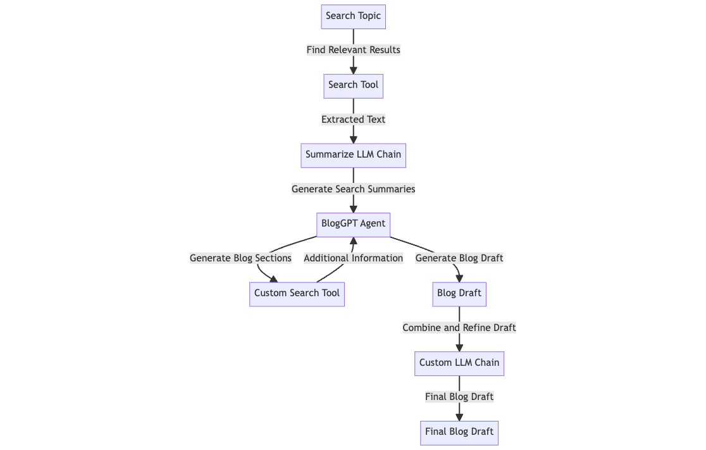

# BlogGPT

BlogGPT is a powerful tool that utilizes Large Language Models (currently only supporting GPT-3.5 and GPT-4) to generate high-quality blog content. It offers a streamlined way of creating blog drafts, saving valuable time and effort in the content creation process.

## Features
1. Search and summarize web URLs to generate topic context using LLM chain.
    - Uses search tool to find relevant search results for the topic.
    
    - Summarize LLM Chain summarizes each url to generate a topic summary.

2. Automatic generation of blog sections using BlogGPT Agent.
    - Agent uses topic context and also search additional information on the blog section using custom search tool.

    - Agent iterates over all blog sections to generate a blog draft.

3. Combine and refine generated blog draft to create a final blog draft using a custom LLM chain.




## Installation

This project uses [Poetry](https://python-poetry.org/) for dependency management. To set up the project:

1. Clone the repository:

    ```bash
    git clone https://github.com/yourusername/bloggpt.git
    cd bloggpt
    ```

2. Install [Poetry](https://python-poetry.org/docs/#installation):

    ```bash
    curl -sSL https://install.python-poetry.org | python -
    ```

3. Install the project dependencies:

    ```bash
    poetry install
    ```

## Configuration

Copy the `.env.template` file to `.env` and fill in the appropriate values:

```bash
cp .env.template .env
```

### OpenAI API Key

This project uses the OpenAI API, which requires an API key. Here's how you can get this key:

1. Go to the OpenAI website (https://www.openai.com/).

2. If you haven't already, sign up for an account.

3. After logging in, navigate to the API section. 

4. You will find your API key in this section. Copy this key - you'll need to provide it as the value for `OPENAI_API_KEY` in the `.env` file.

Please ensure that you keep this key secure and do not share it with anyone. Also, be aware of the usage costs associated with the OpenAI API.


### Google Search Configuration

This project uses the Google Custom Search JSON API which requires the setup of a Programmable Search Engine. Here's how you can get these credentials:

#### Getting the Google API Key

1. Go to the Google Cloud Console (https://console.cloud.google.com/).

2. If you haven't already, create a new project.

3. Enable the Custom Search API for your project. To do this, go to the "Library" in the Cloud Console. Search for "Custom Search API" and enable it.

4. Create credentials for the Custom Search API. To do this, go to the "Credentials" menu in the Cloud Console. Click "Create credentials" and select "API Key".

5. Your new API key will appear. Copy this key - you'll need to provide it as the value for `GOOGLE_API_KEY` in the `.env` file.

#### Getting the Custom Search Engine ID

1. Go to the Programmable Search Engine (formerly custom search engine) console (https://programmablesearchengine.google.com/about/).

2. Click "New Search Engine" and fill in the websites you want to search. You can enter whole domains or specific URLs. If you want your search engine to search the entire web, enter `*` as the site to search.

3. Click "Create".

4. After the search engine is created, go to its settings. Here you can find the "Search Engine ID" (or "cx"). Copy this ID - you'll need to provide it as the value for `GOOGLE_CSE_ID` in the `.env` file.

*You can follow the following [blog](https://blog.expertrec.com/google-custom-search-json-api-simplified/) for more detailed steps*

## Usage
To use the module, you need to run the Streamlit app (make sure to be in the root directory):
```bash
streamlit run bloggpt/main.py
```

### Usage (Streamlit)
You will have to fill up a few text boxes before generating the blog draft. The following are the text boxes that you need to fill up:

- Topic: The topic of the blog that you want to generate. This will be used to search for relevant web pages and to generate the topic context.
- Blog Sections: For each blog section, you need to provide the following:
    - Section Title: The title of the blog section. The title should start with `#` to indicate that it is a header.
    - Section Context: The context of the blog section. This will be used to generate the blog section. Mention key things that you want to be included in the blog section. As well, you can include `Search for: (keywords)` to indicate that you want the agent to search for additional information on the topic.
- Add New Blog Section: Click this button to add another blog section.

## Demo

For a detailed walkthrough of how to use the BlogGPT module, check out this:


You can check out the blog that was generated from this demo [here](https://medium.com/@minh.hoque/exploring-the-falcon-llm-the-new-king-of-the-jungle-5c6a15b91159).

## Blog
You can check out my blog post on Medium [here](https://medium.com/@minh.hoque/bloggpt-your-personal-ai-blog-writer-2e58119199f0).

*And yes… The blog was also 90% generated by BlogGPT ;)*

## Contributing

Contributions to BlogGPT are welcome! No guidelines for now... just open a PR and we'll figure it out.

## License

[MIT](LICENSE)